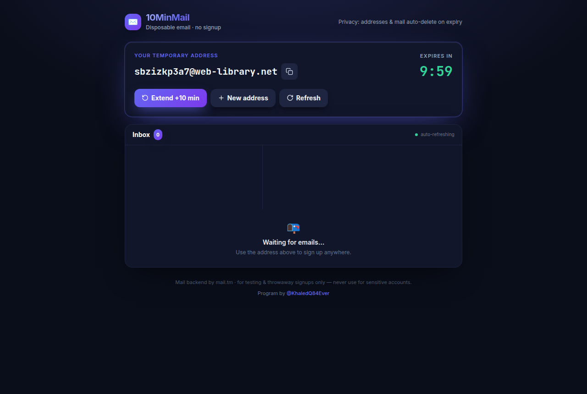
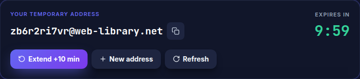
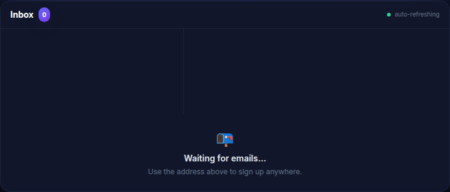
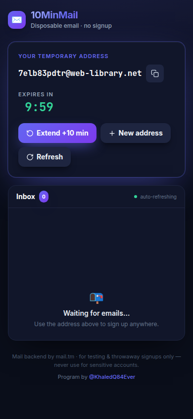
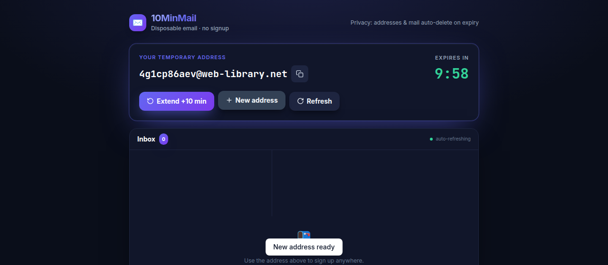

<div align="center">

# ✉️ 10MinMail

### Disposable 10‑minute temporary email — real inbox, zero signup

Get a real, working throwaway email address the instant you open the page.
Receive **real** inbound mail, verify any account, then let it auto‑expire.

[](https://10minmail-production.up.railway.app)
[](https://tailwindcss.com)
[](https://railway.app)
-22c55e?style=for-the-badge)

**🔗 Live:** https://10minmail-production.up.railway.app

</div>

---

## 📸 How it works — in 5 steps

### 1. Open the page → you instantly get your own unique address
Every visitor gets a **fresh, random address** (10 crypto‑random characters) the moment the page loads. No two users share an inbox.



### 2. Copy your address & watch the timer
One‑click **copy**, a live **10‑minute countdown** (green → amber under 2 min → red under 30 s), and three actions: **Extend +10 min**, **New address**, **Refresh**.



### 3. The inbox auto‑refreshes — no manual reload
The inbox polls every 5 seconds and pops a toast the moment new mail lands. Just sign up somewhere and watch it arrive.



### 4. Works great on mobile
Fully responsive, mobile‑first layout — use it straight from your phone.



### 5. Need a clean slate? One click for a brand‑new address
**New address** instantly swaps in a fresh mailbox (the old one is deleted server‑side) and confirms with a toast.



---

## ✨ Features

| | |
|---|---|
| 🎲 **Unique per visitor** | Each user/device gets its own random address — nothing shared |
| 📬 **Real inbound mail** | Backed by the public **mail.tm** API (real domain + MX), so messages actually arrive |
| ⏱️ **10‑minute timer** | Color‑coded countdown; **Extend +10** (up to 60 min total) |
| 💾 **Survives refresh** | Mailbox is restored from `localStorage` and renewed on reload — you don't lose it |
| 🔗 **Clickable links** | Verification links open in a new tab (sandboxed iframe, scripts disabled) |
| 🔄 **Auto‑refresh** | Inbox polls every 5 s with a "new mail" toast |
| 🧹 **Self‑cleaning** | Mailbox is deleted via the API on expiry |
| 🪶 **No backend** | Pure static `index.html` + `app.js` (Tailwind via CDN) |

---

## 🏗️ Architecture

```
Browser (static index.html + app.js, Tailwind CDN)
        │
        │  fetch() with retry/back‑off + token re‑auth
        ▼
   mail.tm public API  ──►  owns the domain + real MX  ──►  receives real email
        │
        ▼
   localStorage  (per‑browser session: address, token, expiry — survives refresh)
```

- **Frontend‑only.** There is no server of our own — `serve` just hosts the static files.
- **mail.tm** owns the domain and MX records, so addresses receive genuine inbound mail.
- **Per‑browser session** in `localStorage` keeps the same mailbox across refreshes until the timer ends; on reload an expired timer is renewed (same address) instead of wiped.

---

## 🚀 Run locally

```bash
npm install
npm start          # serves on http://localhost:3000
```

## ☁️ Deploy (Railway)

```bash
railway up --service 10minmail --detach
railway domain     # prints the public URL
```

Static serving is handled by `serve` (see the `start` script in `package.json`, binds `$PORT`).

---

## 🛡️ Resilience

- API calls **retry** on `429` / `5xx` / network errors with exponential back‑off (honouring `Retry-After`), so mail.tm's rate limit never surfaces as a hard failure.
- If the session token expires mid‑session, the client **re‑mints** one from stored credentials and retries — polling and reading keep working without a new address.
- A fresh account's first `/token` 401 race is retried; **New address** ignores rapid double‑clicks and restores the current address if creation fails.

---

## ⚠️ Notes & limits

- mail.tm is a shared free service with rate limits (~8 req/s) and its own retention — perfect for throwaway signups, **never for sensitive accounts**.
- Want fully‑owned addresses on **your own** domain? Swap the backend for Cloudflare Email Routing → Worker → webhook.

---

<div align="center">

Program by **[@KhaledQ84Ever](https://x.com/KhaledQ84Ever)**

</div>
